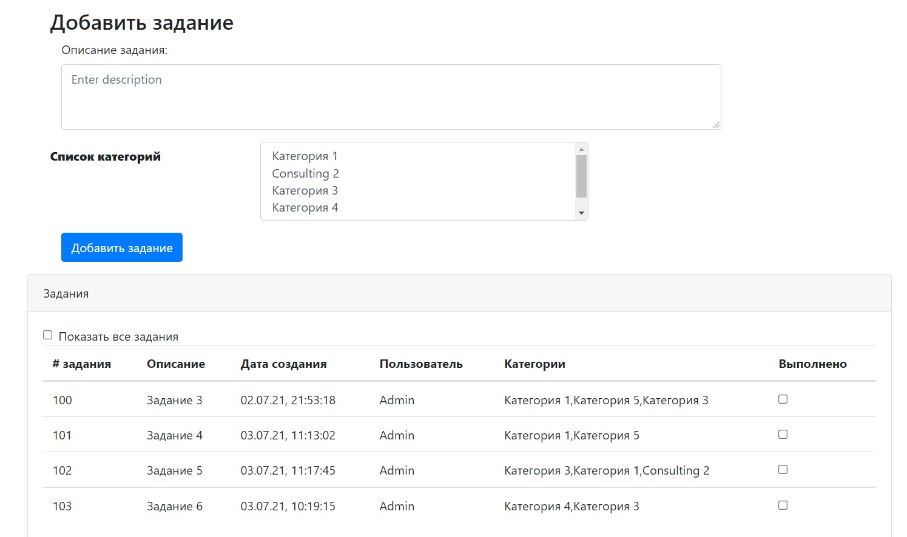
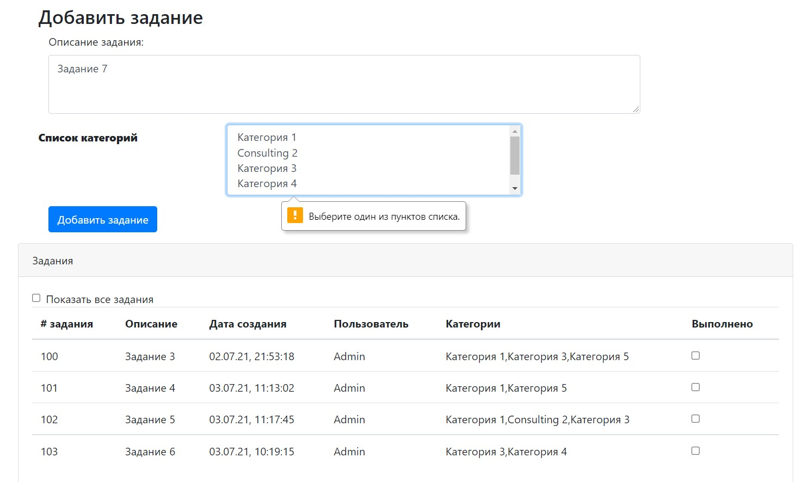
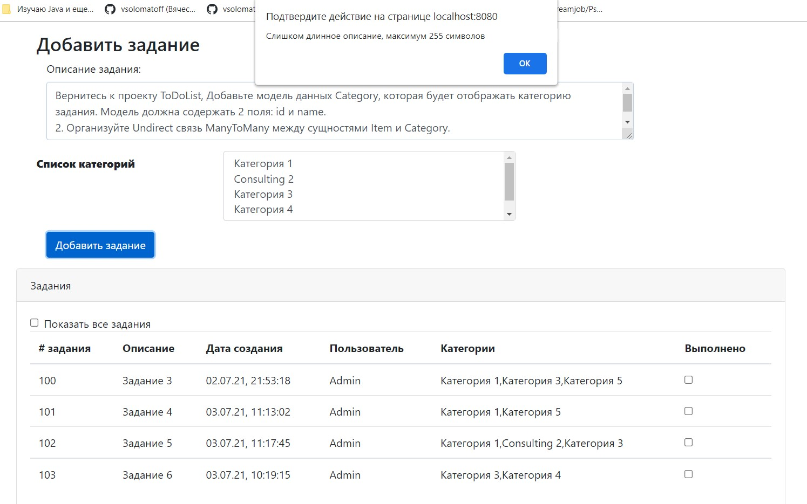
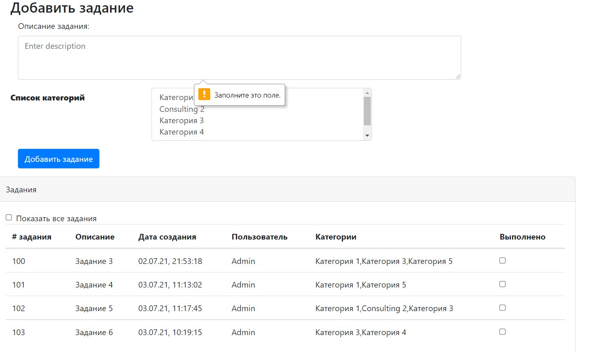
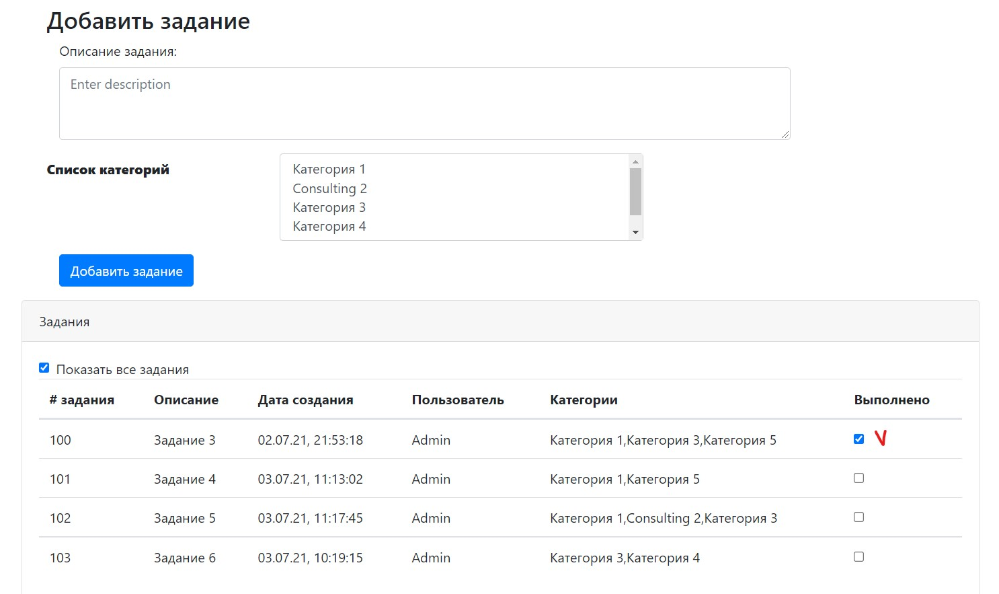
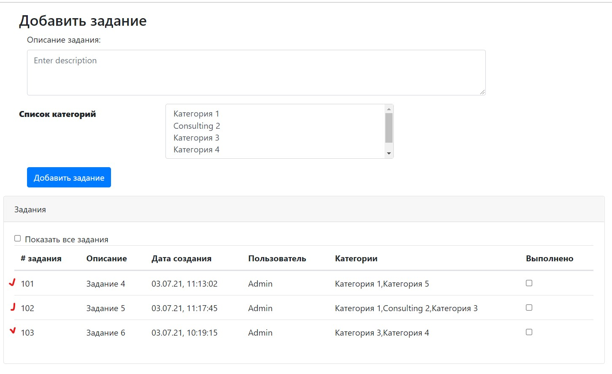
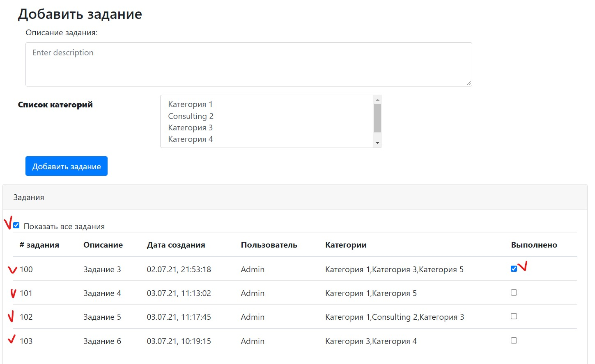

# Учебное приложение "ToDo list".
Приложение имеет одну страницу со списком дел index.html.
Если дело сделано, то его отмечают, как выполненное и оно исчезает из списка.

### Главная страница

### Добавление задания

### Использование галки "Выполнено"

### Использование галки "Показать все задания"

